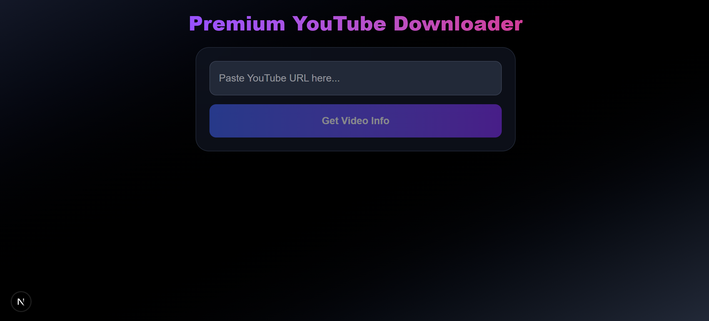

# YouTube Downloader – Next.js + FastAPI



A fast, secure, and modern YouTube downloader built with **Next.js (App Router)** for the frontend and **FastAPI** for the backend.
Supports:

✅ English-forced metadata
✅ High-quality video selection
✅ Safe server-side downloads
✅ Auto-delete temporary files
✅ Premium UI design (Next.js + TailwindCSS)

---

## 🚀 Features

### 🔍 Video Info Fetching

* Retrieves video details in **English**, including:

  * Title
  * Thumbnail
  * Description
  * Uploader
  * Duration
  * All available quality options (format_id, resolution, etc.)

### 🎥 Quality Selection

* Users can select the quality/format they want.
* Fully compatible with YouTube’s multiple quality streams.

### 📥 Safe Video Downloading

* Uses yt-dlp on the server for safe downloads.
* No direct YouTube requests from the frontend.
* Video files are **auto-deleted after 10 minutes**.

### 🟦 Modern UI (Next.js)

* Clean, responsive design
* Premium colors
* Smooth loading states
* User-friendly experience

---

## 🧱 Technology Stack

### Frontend

* Next.js (App Router)
* React
* TailwindCSS

### Backend

* FastAPI
* Python 3.10+
* yt-dlp
* Uvicorn

---

## 📁 Project Structure

```
project/
│
├── backend/
│   ├── main.py             # FastAPI server with /info & /download
│   ├── requirements.txt     # yt-dlp, fastapi, uvicorn, etc.
│   └── downloads/           # Auto-deleted downloaded files
│
└── frontend/
    ├── app/
    │   └── page.tsx        # Main Next.js UI
    ├── public/
    └── package.json
```

---

## ⚙️ Backend Setup (FastAPI)

### 1️⃣ Install dependencies

```bash
cd backend
pip install -r requirements.txt
```

### 2️⃣ Run the server

```bash
uvicorn main:app --reload --port 8000
```

Backend runs at:

```
http://localhost:8000
```

---

## 🎨 Frontend Setup (Next.js)

### 1️⃣ Install dependencies

```bash
cd frontend
npm install
```

### 2️⃣ Start the development server

```bash
npm run dev
```

Frontend runs at:

```
http://localhost:3000
```

---

## 🔗 API Endpoints

### POST /info

Fetches detailed video metadata.

#### Request

```json
{
  "url": "https://www.youtube.com/watch?v=XXXX"
}
```

#### Response

```json
{
  "title": "Video Title",
  "thumbnail": "https://...",
  "formats": [
    {
      "format_id": "22",
      "resolution": "720p",
      "ext": "mp4"
    }
  ]
}
```

---

### POST /download

Downloads the selected video file.

#### Request

```json
{
  "url": "https://www.youtube.com/watch?v=XXXX",
  "format_id": "22"
}
```

#### Response

A file stream (`video.mp4`)

🎯 Files are automatically deleted after 10 minutes.

---

## 🔒 Security Notes

* No YouTube API keys required
* All downloads processed server-side
* Temporary files automatically cleaned
* CORS enabled for safe frontend communication

---

## 📦 Deployment

### Backend

Can be deployed to:

* VPS (Ubuntu)
* Railway
* Render
* Docker
* AWS / Google Cloud

### Frontend

Deploy easily on:

* Vercel
* Netlify
* Any static hosting supporting Next.js

---

## 📝 License

This project is free to use and modify under the **MIT License**.

---

## 💡 Credits

Built with ❤️ by **chrispydev**.
Powered by **Next.js**, **FastAPI**, and **yt-dlp
